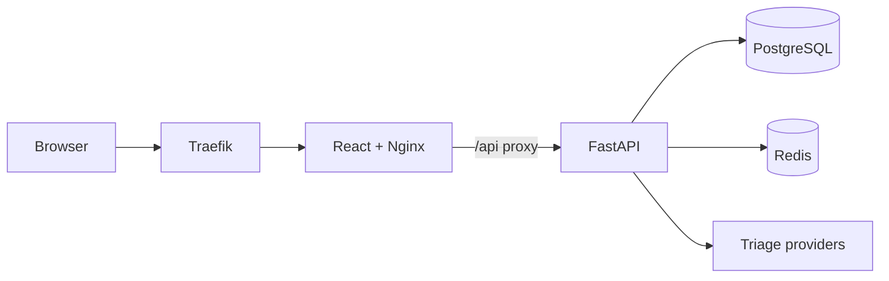

# CivicPulse

CivicPulse is a civic-complaint reporting MVP. Residents submit text and a location; FastAPI classifies, prioritizes, stores, and exposes complaint data through PostgreSQL and Redis-backed services.

## Status

The recorded CD run built SHA-tagged images, generated SBOMs, deployed an ephemeral k3d cluster, and passed ingress smoke tests. Personal evidence must be captured from real sessions.

## Architecture

## Quickstart

Copy `.env.example` to `.env`, then run `docker compose up -d --build`. Open `http://localhost:8080`; backend health is `http://localhost:8000/health`.

## API

| Method | Endpoint | Purpose |
|---|---|---|
| GET | `/health` | Process health |
| GET | `/ready` | Database readiness |
| GET | `/metrics` | Minimal metrics |
| GET | `/providers` | Provider and recent outcomes |
| POST | `/api/complaints` | Create and triage complaint |
| GET | `/api/complaints` | List/filter complaints |
| GET | `/api/complaints/{id}` | Read one complaint |
| PATCH | `/api/complaints/{id}/status` | Change status |
| GET | `/api/stats` | Aggregated statistics |

## Docker and Kubernetes

Compose runs PostgreSQL, Redis, FastAPI, and Nginx. Production Compose uses prebuilt images and does not publish database or Redis ports. Kubernetes uses Kustomize overlays, an HPA, and a recommendation-only VPA (`updateMode: Off`).

## CI/CD

`ci.yml` runs on `dev` pushes and pull requests. `cd.yml` tests `main`, pushes SHA-tagged GHCR images, creates SBOMs, and validates an ephemeral k3d deployment. `release.yml` publishes semver images for `v*` tags.

## Testing

Backend tests run inside the Compose network so they can reach PostgreSQL and Redis. Frontend tests use Vitest and the production build uses Vite. Detailed commands are in `docs/RUNBOOK.md`.

## Evidence

See `docs/evidence/README.md`. Real screenshots, partner collaboration, branch protection, rollback demonstrations, and the demo video cannot be fabricated by automation.

## Rollback

Use `kubectl rollout undo deployment/backend -n civicpulse` and the equivalent frontend command, or pin a previous known-good SHA in `k8s/overlays/prod/kustomization.yaml` and apply the overlay.
